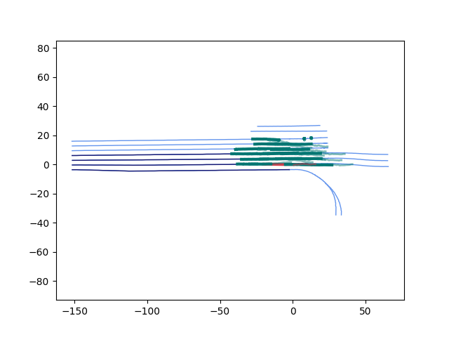

**Still unfinished**

## Implement VectorNet using the NuPlan Dataset

This guide outlines the steps to implement VectorNet using the NuPlan dataset.

### Requirements
In addition to the dependencies required by the `NuPlan-devkit`, the only additional library needed is `pyG`. It is recommended to use `torch_geometric` version `2.0.3`.

#### Installation Steps:
1. Download the `.whl` files for `pyG` from [this link](https://data.pyg.org/whl/torch-1.9.0%2Bcu111.html).
2. Choose the files tagged with `cp39-linux` and the appropriate version for your setup.
3. Install the downloaded `.whl` files using pip:
   ```bash
   pip install <path_to_downloaded_file>.whl
   ```
4. Install `torch_geometric`:
   ```bash
   pip install torch_geometric==2.0.3
   ```

### Workflow

#### Step 1: Process Data for Training
Run the following command to prepare the data for training:
```bash
python3 process_data.py
```

#### Step 2: Train VectorNet
To start training VectorNet, execute:
```bash
python3 train.py
```

#### Step 3: Visualize the Prediction Result
Follow the instructions in `visual.ipynb` to visualize the prediction results. The visualization notebook allows you to see the outcomes interactively within a Jupyter environment.

### Additional Information
- Configuration settings can be modified in `utils/config.py`.
- Example of a prediction result:


